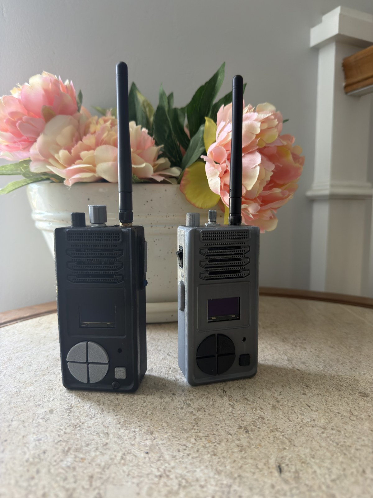
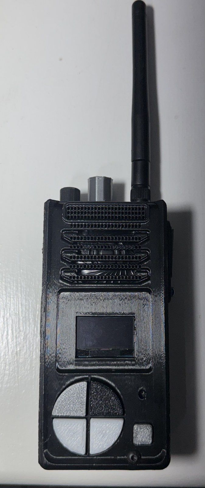
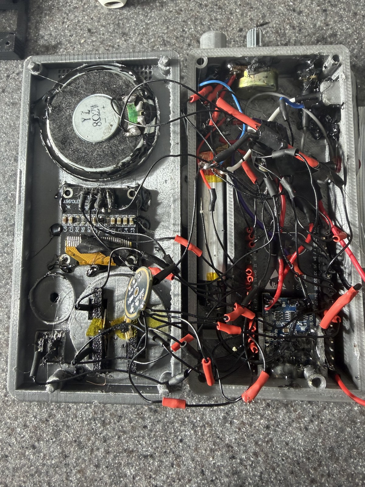
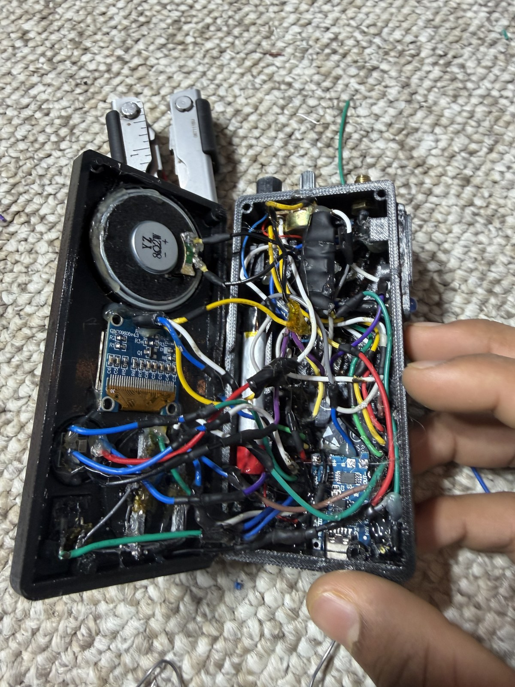

<p align="center">
  
</p>

# ESP32 ESP-NOW Walkie Talkies

Open-source ESP32 walkie talkies built from hacked toy walkie-talkie shells, I2S audio hardware, OLED screens, reclaimed lithium batteries, and custom ESP-IDF firmware. This repository is intended to include everything needed to study, modify, rebuild, and improve the project: firmware, wiring documentation, bill of materials, photos, and CAD/enclosure files.

The project is licensed under the [MIT License](LICENSE), so you can use the code and hardware documentation for your own builds, school projects, experiments, or upgraded versions. The folder [`Walkie Talkie CAD files`](Walkie%20Talkie%20CAD%20files/) is reserved for open-source CAD models, enclosure modifications, brackets, mounts, and printable parts.

The original source photos are kept in [`Assets`](Assets/). The README uses optimized JPEG copies in [`Assets/readme`](Assets/readme/) so the photos display reliably on GitHub.

## Project Overview

This is the second major version of a custom digital walkie-talkie system. The radios communicate directly with each other using ESP-NOW instead of a Wi-Fi router, and the firmware is written in C with Espressif ESP-IDF so it can run much faster and more predictably than the original MicroPython prototype.

The current build uses an ESP32-U style board with an external antenna, a small OLED display, an I2S microphone, an I2S speaker amplifier, a potentiometer for volume, hardware buttons, a laser, and an LED. The goal is a compact two-way voice communicator with a phone-like interface, channel selection, link status, battery monitoring, lights controls, and experimental long-range ESP-NOW audio.

### Highlights

- Direct peer-to-peer ESP-NOW voice communication with no router or access point required.
- External antenna ESP32 hardware for improved range compared with PCB antenna modules.
- Long-range ESP-NOW radio configuration with maximum requested ESP32 transmit power and ESP32 LR PHY peer rate settings.
- Designed for up to about 1 mile line-of-sight range under ideal outdoor conditions, with real range depending heavily on antenna placement, interference, obstacles, body blocking, and battery voltage.
- 16 kHz mono voice capture with IMA ADPCM compression so each 20 ms audio frame fits in one ESP-NOW packet.
- Jitter buffering and packet-loss concealment to make received voice less choppy when packets arrive unevenly.
- OLED interface with channel, link, signal meter, battery, volume, RX/PTT indicators, app menu, settings, lights controls, and kid mode.
- Separate black and grey walkie profiles because the two physical builds have slightly different GPIO wiring.
- MIT-licensed firmware and documentation so the project can be forked, improved, and rebuilt.

## More Than a Walkie Talkie

Even though the main feature is voice communication, this project is also a handheld ESP32 Wi-Fi controller platform. Because each unit has buttons, a display, audio, battery power, ESP-NOW, and normal Wi-Fi capability, the same hardware can be reused to control other Wi-Fi or IoT projects.

Future uses could include controlling RC cars, robots, lights, remote sensors, or any custom ESP32/IoT device that accepts ESP-NOW, Wi-Fi UDP/TCP, MQTT, HTTP, or another wireless command protocol. The walkie shell becomes more like a rugged handheld controller with a built-in voice channel.

<p align="center">
  
</p>

## Walkie Talkie Components

The project keeps the toy-walkie form factor, but the original internals were replaced with an ESP32-based digital audio system.

<p align="center">
  
  
</p>

### Main Electronics

- ESP32-U class development board with 240 MHz CPU, 4 MB flash, about 512 KB internal SRAM, Wi-Fi, Bluetooth hardware, and an external antenna connector.
- SSD1306-style OLED display for the full GUI.
- I2S digital microphone for voice input.
- I2S speaker output feeding a MAX9875A-style speaker amplifier.
- Small speaker inside the original walkie shell.
- Potentiometer for analog volume control.
- Reclaimed 3.85 V nominal lithium battery pack rated around 2000 mAh.
- GPIO buttons for PTT, OK/select, navigation, back, and apps/settings.
- LED used as a transmit/status/light output.
- Laser module used as a manual output and as part of the lights app.
- Voltage divider into an ADC pin for battery measurement.

Important battery note: the prototype batteries were found in a discarded vape on the ground and reused for this build. That is part of the project history, but it is not a safety recommendation. If you build your own, use a known-good lithium cell with a protection circuit, proper charging hardware, insulation, strain relief, and a safe enclosure. Do not reuse unknown, punctured, swollen, or damaged lithium cells.

## Circuit Diagram

The high-level circuit diagram shows how the ESP32 connects to the display, I2S audio devices, buttons, analog inputs, LED, laser, and battery measurement circuit.

<p align="center">
  
</p>

### Shared Pinout

| Function | ESP32 GPIO | Notes |
| --- | ---: | --- |
| OLED SCL | GPIO18 | I2C clock |
| OLED SDA | GPIO19 | I2C data |
| Speaker BCLK | GPIO32 | I2S output bit clock |
| Speaker WS/LRC | GPIO33 | I2S output word select |
| Speaker DIN | GPIO25 | I2S output data |
| Microphone BCLK | GPIO16 | I2S input bit clock |
| Microphone WS | GPIO17 | I2S input word select |
| Microphone SD | GPIO4 | I2S input data |
| OK button | GPIO0 | Active low |
| Bottom-left button | GPIO14 | Active low |
| Bottom-right button | GPIO15 | Active low |
| Laser | GPIO21 | Output |
| Volume potentiometer | GPIO34 | ADC input |
| Battery divider | GPIO35 | ADC input |

### Black and Grey Variant Pinout

The two walkies are not wired exactly the same, so the firmware has board profiles in `menuconfig`.

| Function | Black walkie | Grey walkie |
| --- | ---: | ---: |
| PTT button | GPIO22 | GPIO23 |
| LED output | GPIO23 | GPIO22 |
| Top-left button | GPIO26 | GPIO2 |
| Top-right button | GPIO2 | GPIO26 |
| Battery divider | 100k / 100k | 220k / 220k |
| Default peer | Grey MAC | Black MAC |

Default ESP-NOW peer MAC addresses:

- Black walkie: `A4:F0:0F:66:D2:D0`
- Grey walkie: `A4:F0:0F:67:BA:1C`

## Internal Build: Grey Walkie

<p align="center">
  
</p>

The grey walkie is the second iteration. Its internal wiring and soldering are much cleaner, with thinner wires used between modules. That makes the inside less congested, easier to inspect, and easier to debug. Compared with the first build, the grey unit has a more intentional layout and less mechanical stress on the small solder joints.

The cleaner wiring also matters for audio. Digital microphones, I2S speaker signals, and ESP32 Wi-Fi bursts can all become annoying to debug when power, ground, and signal wiring are crowded together. Keeping the second iteration cleaner made it easier to isolate software audio problems from wiring problems.

## Internal Build: Black Walkie

<p align="center">
  
</p>

The black walkie is the first ESP32 iteration. It works, but the internal wiring uses much thicker wires and is more congested inside the shell. This made the build harder to close, harder to inspect, and harder to modify later.

The black unit also revealed why the firmware needs board profiles. Its PTT and LED pins are swapped compared with the grey unit, and the top-left/top-right buttons are swapped too. Instead of rewiring both units to be identical, the firmware supports both physical layouts.

## Project History

This walkie-talkie design took multiple iterations before reaching the current ESP32 ESP-IDF version.

The first approach used a Raspberry Pi Pico with an NRF24L01 radio module. That was useful for learning, but it became difficult for real voice audio. The Pico does not have the same straightforward I2S peripheral setup as the ESP32 for this project, and using PIO to implement I2S was too difficult and time-consuming for this build. NRF24L01 audio transport also would have required more custom protocol work.

The project then moved to an ESP32 with an external antenna. That change helped a lot because ESP32 has strong documentation, built-in Wi-Fi radio hardware, ESP-NOW support, mature ESP-IDF tooling, and standard I2S peripherals for both microphone input and speaker output. Moving from MicroPython to compiled ESP-IDF firmware also made the system faster and gave more control over timing, buffering, compression, and GPIO behavior.

## Firmware Features

The firmware is an ESP-IDF project designed for the Espressif VS Code extension and command-line `idf.py`.

### User Interface

- Main PTT screen with device name, battery icon, voltage, channel number, link state, volume, laser state, signal meter, RX activity, and PTT activity.
- Channel display formatted as `< CH XX >` to show that top-left/top-right can change channels.
- Apps menu with `TX WIFI`, `RX WIFI`, `TEXT`, `BUTTON CTRL`, `LIGHTS`, and `KID MODE`.
- Settings page with audio limiting, low-battery limiting, speaker boost, mic boost, mic cut, flash usage, memory usage, and CPU overlay.
- Lights app with strobe, target selection, rate, constant LED, constant laser, and preset patterns.
- Kid mode locked to channel 1, with OK held for 2 seconds to exit.

### Radio and Link System

- Uses ESP-NOW for peer-to-peer packets.
- Uses a logical channel number from 1 to 20 inside every packet.
- Uses RF channel from ESP-IDF config, currently defaulting to channel 6.
- Sends heartbeat packets so the UI can show `LINK ON` or `LINK OFF`.
- Reads RSSI from received ESP-NOW metadata when available.
- Smooths RSSI into a signal-quality percentage for the left-side signal meter.
- Requests maximum ESP32 Wi-Fi transmit power with `esp_wifi_set_max_tx_power(84)`.
- Disables Wi-Fi power saving for more consistent latency.
- Configures the ESP-NOW peer for ESP32 long-range PHY rate when supported by the IDF and hardware.

### Audio Transport

Audio is sent as compressed voice frames over ESP-NOW.

- Microphone sample rate: 16 kHz mono.
- Frame duration: 20 ms.
- Samples per frame: 320.
- Compression: IMA ADPCM at 4 bits per sample.
- Audio payload per frame: 160 bytes.
- One audio frame is sent in one ESP-NOW packet.
- Packet rate while PTT is held: 50 audio packets per second.
- Packed audio packet size: 171 bytes.

Audio packet fields:

| Field | Size | Purpose |
| --- | ---: | --- |
| Packet type | 1 byte | `0xA1` for audio |
| Protocol version | 1 byte | Firmware protocol version |
| Logical channel | 1 byte | 1 to 20 software channel |
| Flags | 1 byte | Kid-mode/audio flags |
| Sequence number | 2 bytes | Detects ordering and loss |
| ADPCM predictor | 2 bytes | Decoder state for the frame |
| ADPCM step index | 1 byte | Decoder step size state |
| Sample count | 2 bytes | Usually 320 |
| ADPCM payload | 160 bytes | Compressed voice samples |

Control packet types:

| Packet | Value | Purpose |
| --- | ---: | --- |
| Audio | `0xA1` | Compressed voice |
| Heartbeat | `0xB1` | Link detection |
| Scan request | `0xB2` | Channel scan |
| Scan response | `0xB3` | Channel scan reply |

### Audio Cleanup

The firmware includes several processing steps to make ESP-NOW voice more understandable:

- I2S microphone capture uses the left channel because the microphone L/R pin is tied to ground.
- A mic warmup discards the first frames after PTT starts so the beginning of a transmission is less noisy.
- A high-pass filter reduces DC offset and low-frequency rumble.
- Noise-floor tracking helps distinguish quiet background from voice.
- Gentle speech gating reduces background noise without fully chopping quiet speech.
- Per-board mic gain profiles compensate for the black and grey builds having different real-world microphone behavior.
- Speaker boost and mic boost settings adjust fixed-point gain in the firmware.
- A receive jitter buffer smooths packet arrival timing.
- Packet-loss concealment fills short gaps so missed packets sound less harsh.

## Code Structure

| Path | Purpose |
| --- | --- |
| `main/main.c` | Main application state, board selection, GPIO, ADC, ESP-NOW, I2S setup, FreeRTOS tasks, buttons, menus, lights, heartbeat, scan, capture, playback, and resource stats |
| `main/walkie_audio.c` | Microphone cleanup, gain, ADPCM encode/decode, playback scaling, and packet-loss concealment helpers |
| `main/walkie_audio.h` | Audio API shared with the main application |
| `main/walkie_display.c` | SSD1306 OLED driver, framebuffer drawing, fonts, and all UI screens |
| `main/walkie_display.h` | Display API |
| `main/walkie_types.h` | Shared board, UI, settings, lights, and snapshot structures |
| `main/Kconfig.projbuild` | Menuconfig options for black/grey board profiles, MAC addresses, and RF channel |
| `sdkconfig.defaults` | Default ESP-IDF project settings |
| `CMakeLists.txt` | Top-level ESP-IDF project definition |

## Runtime Tasks

The firmware is split into a few FreeRTOS tasks:

- `control_task` reads buttons, updates menus, smooths volume/battery readings, sends heartbeats, updates outputs, and redraws the OLED.
- `capture_task` runs while PTT is pressed, reads the I2S microphone, processes voice, compresses it, and sends ESP-NOW audio frames.
- `radio_task` receives ESP-NOW packets from the callback queue and routes heartbeats, scans, and audio frames.
- `playback_task` drains the receive jitter buffer and writes decoded audio to the I2S speaker path.

This split keeps the UI responsive while audio and radio work continue in the background.

## Build and Flash

Open the folder in VS Code with the Espressif IDF extension, or use the ESP-IDF command line.

### Configure the board

Run:

```powershell
idf.py menuconfig
```

Then open:

```text
Walkie Talkie Configuration
```

Choose either:

- `Black walkie`
- `Grey walkie`

This selects the correct PTT, LED, top-left, top-right, battery smoothing, mic gain, and peer MAC behavior.

### Build

```powershell
idf.py build
```

### Flash

Replace `COM6` with your actual serial port:

```powershell
idf.py -p COM6 flash monitor
```

On this Windows setup, the Espressif environment can also be loaded with:

```powershell
powershell -ExecutionPolicy Bypass -NoProfile -Command "& { . 'C:\Espressif\tools\Microsoft.662a3be.PowerShell_profile.ps1'; idf.py -p COM6 flash monitor }"
```

## Resource Usage

The firmware targets the ESP32 at 240 MHz with 4 MB flash. A recent build of this project used approximately:

| Resource | Approximate usage |
| --- | ---: |
| Firmware app image | 817 KB |
| App partition used | 53 percent |
| App partition free | 719 KB |
| Flash code | 590 KB |
| Flash data | 119 KB |
| Static DRAM | 43 KB |
| Static DRAM remaining | 138 KB |
| IRAM | 90 KB |
| IRAM remaining | 41 KB |

Most of the flash usage comes from ESP-IDF Wi-Fi, ESP-NOW, networking, and support libraries, not from the walkie application code itself.

The CPU runs at a fixed 240 MHz in the current configuration because dynamic power management is disabled. The CPU percentage shown in the UI is a firmware activity/debug indicator, not a clock-speed readout.

## Power Usage and Battery Life

The prototype battery is a 3.85 V nominal high-capacity lithium cell rated around 2000 mAh. Actual runtime depends on volume, transmit duty cycle, LED/laser use, Wi-Fi conditions, battery health, regulator efficiency, and speaker loudness.

Estimated current draw:

| Mode | Estimated current |
| --- | ---: |
| Idle/listening, OLED on, no audio | 125 to 175 mA |
| Receiving voice at about 50 percent volume | 180 to 270 mA |
| PTT transmit with LED on, no speaker playback | 180 to 280 mA |
| Busy worst case with RX audio, LED, laser, and high Wi-Fi activity | 250 to 400 mA or more |

Estimated runtime from a 2000 mAh cell:

| Usage pattern | Estimate |
| --- | ---: |
| Mostly idle/listening | 11 to 16 hours |
| Mixed receive/transmit use | 7 to 10 hours |
| Heavy audio and frequent transmit | 5 to 8 hours |
| Near worst-case continuous high draw | 4 to 6 hours |

If the system uses a linear regulator from 5 V down to 3.3 V, the regulator wastes the voltage difference as heat. At 250 mA, the regulator dissipates about `(5.0 V - 3.3 V) * 0.25 A = 0.425 W`. At 350 mA, it dissipates about `0.595 W`. That can become warm in a small plastic enclosure, so a buck regulator would be more efficient for long battery life.

Approximate subsystem draw:

- ESP32 with Wi-Fi active: about 100 to 240 mA depending on receive/transmit activity and RF power.
- OLED: roughly 10 to 25 mA depending on display content and module.
- LED: about 13 mA.
- Laser: about 3 mA.
- Speaker amplifier at 50 percent volume: roughly 50 to 90 mA average for loud voice, with higher peaks depending on speaker impedance and output level.

## Bill of Materials

| Qty | Part | Notes |
| ---: | --- | --- |
| 2 | Toy walkie-talkie shells | Original bodies reused as the enclosure |
| 2 | ESP32-U style development boards | External antenna version recommended |
| 2 | 2.4 GHz external antennas | Improves range when mounted well |
| 2 | SSD1306 OLED displays | I2C, connected to GPIO18/GPIO19 |
| 2 | I2S microphones | L/R tied to GND for left-channel capture |
| 2 | MAX9875A-style speaker amplifier modules | I2S/audio output amplifier stage |
| 2 | Small speakers | Fit inside the original walkie shell |
| 2 | Potentiometers | Analog volume control |
| 2 | 3.85 V nominal lithium batteries | Prototype used reclaimed 2000 mAh vape cells |
| 2 | TP4056 lithium charging/protection boards | Strongly recommended; use protected OUT+/OUT- style modules if possible |
| 2 | 5 V boost converter modules | Boosts the battery output to 5 V for ESP32 VIN/5V and speaker amp power |
| 2 | Power switches/buttons | Placed between TP4056 output positive and boost converter VCC |
| 2 | LEDs | PTT/status/lights output |
| 2 | Laser modules | Manual and lights-app output |
| 10+ | Momentary buttons | Reuse original buttons or replace as needed |
| 4 | Battery divider resistors | Black: 100k/100k, grey: 220k/220k |
| 1 set | Thin silicone wire | Thin wire is much easier to route inside the shell |
| 1 set | Heat-shrink tubing/tape | Insulation and strain relief |
| 1 set | Solder, flux, tools | Assembly and debugging |
| optional | 3D printed brackets or mounts | Place in `Walkie Talkie CAD files` |

## Assembly Process

Start by soldering all of the electronic components outside the walkie-talkie casing. Use wires long enough that each module can reach its final position inside the shell without pulling on the solder joints. Thin flexible wire makes the final assembly much easier, especially around the ESP32, OLED, buttons, speaker, and battery.

Before permanently placing parts, test-fit everything in the casing. The inside of the toy walkie shell is tight, so it helps to route wires before taping, gluing, or screwing modules down.

### Power Wiring

Build the battery power circuit first and verify the polarity before connecting the ESP32 or amplifier.

1. Connect the lithium battery positive and negative wires to the TP4056 battery pads.
2. Connect the TP4056 output ground to the boost converter ground.
3. Route the TP4056 output positive through the main power button or power switch.
4. Connect the output of that power button/switch to the boost converter VCC/input positive.
5. Connect the boost converter 5 V output to the ESP32 5V/VIN input and to the MAX9875A-style amplifier power input.
6. Tie the grounds together so the ESP32, amplifier, OLED, microphone, buttons, LED, laser, boost converter, and TP4056 all share a common ground.

Do not connect the boost converter 5 V output to the ESP32 `3V3` pin. Use the ESP32 board's `5V` or `VIN` input if your development board supports it. Lithium cells can be dangerous if shorted or wired incorrectly, so check the TP4056 labels carefully because different modules may label pads as `B+`, `B-`, `OUT+`, `OUT-`, `IN+`, and `IN-`.

### Physical Placement

1. Insert the TP4056 charging board into its slot first.
2. After the components are soldered, place the ESP32 underneath the charging board, next to the battery.
3. Put the buttons into their original slots in the casing.
4. Place the LED next to the PTT button where the small LED hole is located.
5. Place the laser module in the laser hole.
6. Place the potentiometer in the potentiometer hole.
7. Make sure the external antenna is connected to the ESP32 antenna connector.
8. Route the antenna into the antenna hole to the right of the potentiometer.
9. Put the knob onto the potentiometer shaft.
10. Put the speaker into the speaker slot.
11. Put the microphone into the microphone slot.
12. Put the OLED into the OLED display slot.

Once all parts are seated, close the casing carefully while watching for pinched wires. If the case does not close easily, do not force it; open it again and reroute the thickest wire bundles first. This was one of the biggest improvements in the grey second-iteration build: thinner wires made the internals cleaner, easier to close, and easier to repair.

## Building Your Own

Because this is open source, the intended path is:

1. Fork the repository.
2. Review the circuit diagram and photos.
3. Add or modify CAD files in [`Walkie Talkie CAD files`](Walkie%20Talkie%20CAD%20files/).
4. Wire one black-style or grey-style unit, or create a new board profile.
5. Set the correct peer MAC addresses in `menuconfig`.
6. Build and flash the firmware.
7. Test audio at short range first.
8. Tune mic gain, speaker gain, channel, and antenna placement.
9. Test range outdoors with clear line of sight.

If your wiring differs, add a new board profile instead of hardcoding changes over the existing black/grey profiles. That keeps the firmware easier for other builders to understand.

## Current Limitations and Future Ideas

- Source HEIC photos are preserved in `Assets`, while optimized JPEG copies are used for the README.
- ESP-NOW range is very environment-dependent. The firmware requests long-range settings, but antennas, body position, walls, ground reflections, and interference can dominate real results.
- Audio is half-duplex in the normal walkie-talkie sense: PTT transmits voice, release receives voice. The ESP32 has separate I2S input and output, so full-duplex experiments are possible, but the radio protocol and UI would need more work to avoid collisions.
- The apps menu includes some placeholder-style screens that can become real features later.
- Battery life estimates should be measured with a USB power meter or inline current sensor for the exact hardware.

## License

This project is released under the [MIT License](LICENSE).
